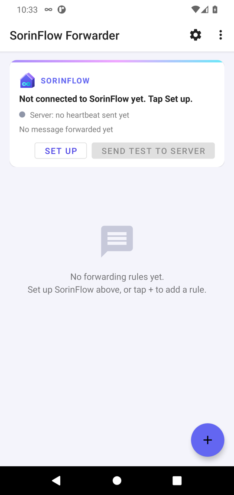
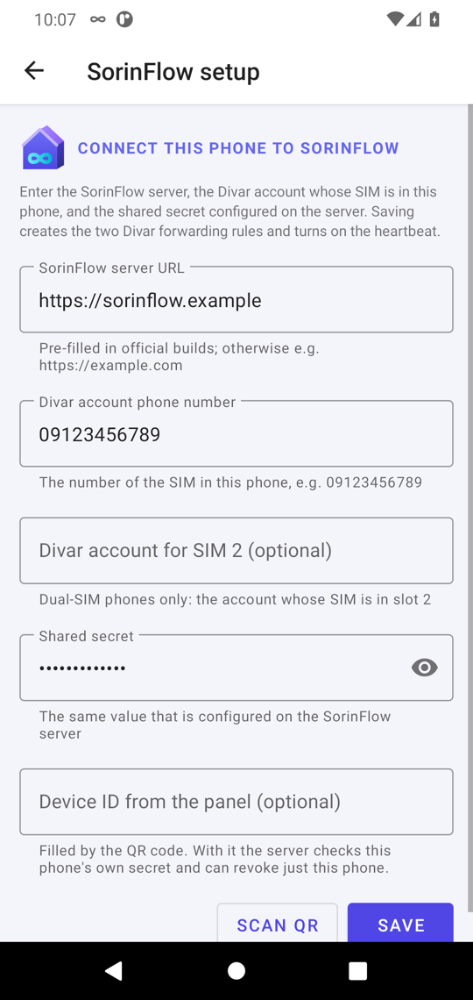
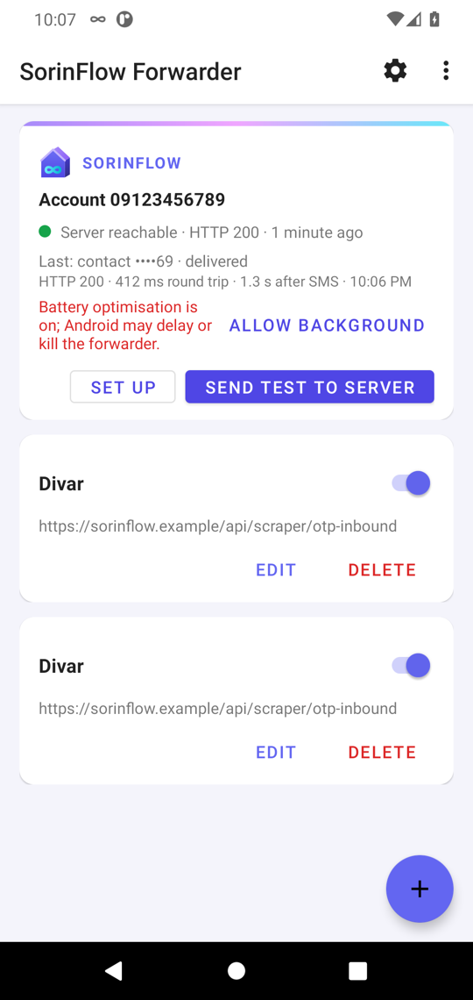
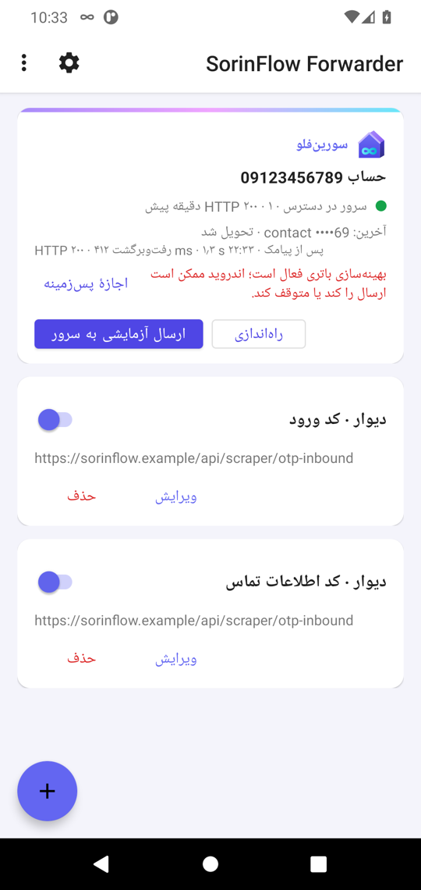
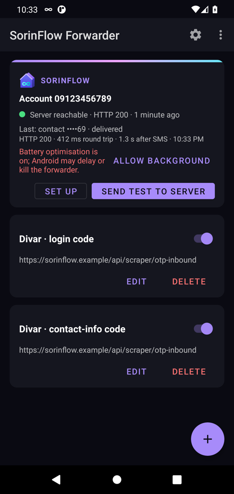
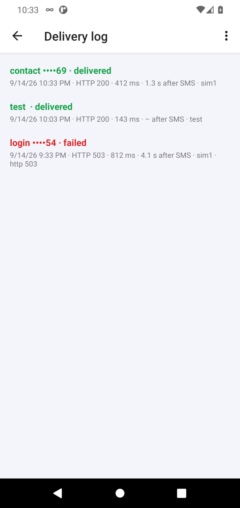

# SorinFlow Forwarder

[](https://github.com/sobhanaz/sorinflow-sms-forwarder/actions/workflows/tests.yml)
[](https://github.com/sobhanaz/sorinflow-sms-forwarder/actions/workflows/release.yml)

An Android app that forwards Divar's one-time-code SMS to a SorinFlow server
within seconds. It runs on the phone that holds the Divar account's SIM; when
Divar sends a **contact-info code** or a **login code**, the app POSTs it,
signed, to `/api/scraper/otp-inbound`, and pings `/api/scraper/forwarder-heartbeat`
every five minutes so the SorinFlow panel knows the phone is alive.

<p align="center">
  
  
  
  
</p>
<p align="center">
  
  
</p>

<sub>Screenshots are taken automatically on an Android 11 emulator by the CI
test suite (`ScreenshotsTest`), so they always show the current build.</sub>

It is a fork of Konstantin Bogomolov's open-source
[Incoming SMS Gateway](https://github.com/bogkonstantin/android_income_sms_gateway_webhook)
(MIT). The generic SMS-to-webhook engine, rule editor, backup/import and syslog
viewer are all still there; the SorinFlow layer sits on top of them.

## Contents

- [Features](#features)
- [How it works](#how-it-works)
- [Server contract](#server-contract)
- [Installing](#installing)
- [Setup (under two minutes per phone)](#setup-under-two-minutes-per-phone)
- [The status card](#the-status-card)
- [Delivery log and alerts](#delivery-log-and-alerts)
- [QR code setup from the panel](#qr-code-setup-from-the-panel)
- [Dual-SIM phones](#dual-sim-phones)
- [Staying alive and up to date](#staying-alive-and-up-to-date)
- [Where things are stored](#where-things-are-stored)
- [Building](#building)
- [Releases from GitHub Actions](#releases-from-github-actions)
- [Project layout](#project-layout)
- [Tests](#tests)
- [Keeping up with upstream](#keeping-up-with-upstream)
- [Known limitations and ideas](#known-limitations-and-ideas)
- [Changelog](#changelog)
- [License](#license)
- [راهنمای فارسی](#راهنمای-فارسی)

## Features

- **Fast**: the code is POSTed immediately from the SMS broadcast on a
  background thread, not through a scheduler; the status card shows the
  measured delay from SMS arrival to the server's answer for every message.
- **Deadline-aware retries**: on failure, retries after 5, 10, 20, 30, 30… s and
  stops 100 s after the SMS arrived. A Divar code older than that is never sent.
- **Signed requests**: every request carries `X-Signature`, a hex HMAC-SHA-256
  of the raw body with a shared secret that is entered on the phone and stored
  encrypted (Android Keystore). It never appears in exports, logs or the APK.
- **Heartbeat**: a signed ping every five minutes (`account`, `battery`,
  `network`, `version`), first one five seconds after the service starts.
- **Status card**: connection identity, server reachability, last forwarded
  message (kind, masked code, HTTP status, round trip, delay after the SMS),
  stored failures, and a **Send test to server** button.
- **Delivery log and alerts**: the last 20 attempts with the server's reason,
  a notification when a code could not be delivered, and one when the server
  has not answered for 15 minutes.
- **QR code setup**: scan the panel's setup code (or open a `sorinflow://setup`
  link) and the form fills itself; no typing, no typos.
- **Dual-SIM phones**: a second Divar account bound to SIM 2.
- **Keepalive and updates**: a 15-minute job restarts the service if the ROM
  killed it, the card asks for the battery-optimisation exemption that makes
  this work, and it offers new releases from GitHub.
- **Survives aggressive ROMs**: manifest SMS receiver (works even after the
  service was killed), foreground service of type `specialUse` (no daily runtime
  limit on Android 14+), the service is restarted on boot and on each SMS.
- **Hardened**: HTTPS only (cleartext disabled), no backups, service not
  exported, Android 14 (API 34) target, `minSdk 26`.
- **Persian and English UI**, right-to-left layout.
- **Everything upstream still works**: arbitrary forwarding rules with regex
  filters and JSON templates, HMAC signing, failed-message store, rule
  export/import, syslog viewer.
- No cloud service, no account, no analytics.

## How it works

1. Android delivers the SMS to the app's manifest-declared receiver. This is
   what lets the app work after an OEM battery manager has killed its service:
   the system cold-starts the process just to deliver the broadcast.
2. The message is matched against the two rules that setup installed: sender
   `Divar` plus the text `اطلاعات تماس` (contact code) or `کد تایید` (login
   code). Any other rules you add by hand are matched the same way.
3. The request body is rendered from the rule's JSON template and sent
   **immediately on a background thread** (10 s connect / 15 s read timeout).
   The foreground service is (re)started at the same time so the process stays
   alive for the request.
4. If that first attempt fails, a WorkManager job (expedited on Android 12+)
   takes over and retries inside one run after 5 s, 10 s, 20 s, 30 s, 30 s…
   It stops as soon as the next retry would land more than 100 s after the SMS
   was received, and stores the message as failed.
5. Every request carries `X-Signature`. All traffic is HTTPS.

| Stage | Typical timing |
|---|---|
| SMS received → rule matched → request sent | a few milliseconds |
| Server answer on mobile data | well under two seconds; shown per message on the card |
| Retries after a failure | 5, 10, 20, 30, 30 s after each other, never past 100 s |
| Heartbeat | 5 s after (re)start, then every 5 min (panel shows *online* if seen within 10 min) |

## Server contract

The app is built to the SorinFlow API and never changes it.

`POST <server>/api/scraper/otp-inbound` for every matched SMS:

```json
{"kind":"contact","account":"09123456789","code":"523969","text":"<raw sms>",
 "sim":"sim1","sentStamp":1757700000000,"receivedStamp":1757700001200,
 "battery":83,"network":"mobile"}
```

- `kind` is `contact` or `login` (the test button sends `test`).
- `code` is the six digits after `Code:`. If the SMS uses another form the
  field is empty and the server extracts the code from `text` itself (it also
  normalises Persian digits).
- `sentStamp` is the time the SMS was sent, `receivedStamp` the time it reached
  the phone, both epoch milliseconds. The server refuses a code older than its
  pending request as `stale_code`, so the real send time is what is sent.
- `sim` is `sim1`/`sim2` when the slot could be detected, else `undetected`.

`POST <server>/api/scraper/forwarder-heartbeat` every five minutes:

```json
{"account":"09123456789","battery":83,"network":"wifi","version":"3.0.0"}
```

Both carry `Content-Type: application/json; charset=utf-8` and
`X-Signature: <lowercase hex HMAC-SHA-256 of the exact body bytes>`. Answers:
`200 {"matched":…,"kind":…,"reason":…,"latency_ms":…}`, `401` on a bad
signature (wrong secret), `429` above roughly 20 requests per minute per IP,
`503` when the server has no secret configured.

## Installing

The app is **not on Google Play and cannot be**: Play's SMS permission policy
does not allow "forward incoming SMS to a URL" apps. Download the APK from the
[Releases](https://github.com/sobhanaz/sorinflow-sms-forwarder/releases) page
(or build it, see below) and sideload it:

```bash
adb install -r sorinflow-forwarder-v3.0.0.apk
```

or copy the APK to the phone and open it from a file manager.

**Play Protect will warn about the app.** That is a false positive: reading SMS
and sending it to a server is the same pattern as SMS-stealing malware, and the
scanner cannot know you configured the destination. Choose *Install anyway* /
*More details → Install anyway*. If Play Protect removed the app, temporarily
turn it off (Play Store → profile → Play Protect → gear → *Scan apps with Play
Protect*), install, and turn it back on.

### Xiaomi / HyperOS (and most Chinese OEM ROMs)

These ROMs kill background apps aggressively. Do all of the following once,
or codes will stop arriving after a few hours:

1. **Allow restricted settings** for the app: Settings → Apps → SorinFlow
   Forwarder → ⋮ (top right) → *Allow restricted settings*. Android 13+ blocks
   sideloaded apps from sensitive permissions until you do this.
2. **SMS permission**: Settings → Apps → SorinFlow Forwarder → Permissions →
   SMS → *Allow*. Also allow **Notifications**.
3. **Battery saver**: Settings → Apps → SorinFlow Forwarder → Battery saver →
   **No restrictions**.
4. **Autostart**: Settings → Apps → Permissions → Autostart → enable the app.
5. **Lock it in Recents**: open the app, open the recent-apps view, long-press
   (or pull down) the app card and tap the lock icon.
6. Settings → Apps → SorinFlow Forwarder → **turn off "Pause app activity if
   unused"** / "Manage app if unused" / "Remove permissions if app isn't used".
7. In Google Messages (or the default SMS app) **disable RCS**: Settings → RCS
   chats → *Turn off RCS chats*. RCS messages never reach the SMS API.
8. Keep the phone on a charger and, ideally, on Wi-Fi plus mobile data.

After that, the SorinFlow infinity icon in the status bar means the forwarder
service is running.

## Setup (under two minutes per phone)

1. Open the app and grant the SMS and notification permissions it asks for.
2. Tap **Set up** on the SorinFlow card (also in the ⋮ menu → *SorinFlow setup*).
3. Fill in:
   * **SorinFlow server URL**: pre-filled in official builds (the address is
     injected at build time from the repository's `SORINFLOW_SERVER_URL`
     secret, see *Releases* below); otherwise type it. https only; a pasted
     endpoint path or trailing slash is stripped automatically.
   * **Divar account phone number**: the number of the SIM in this phone, as
     the Divar account knows it, e.g. `09123456789`. Persian digits are fine.
   * **Shared secret**: the value configured on the server.
   * **Divar account for SIM 2**: only on a dual-SIM phone with a second
     account, see [Dual-SIM phones](#dual-sim-phones).
   Instead of typing, tap **Scan QR** and point the camera at the setup code
   on the SorinFlow panel (see below); the fields fill in for you to check.
4. Tap **Save**. The app creates the two Divar rules (visible in the list below
   the card), turns on the heartbeat, starts the service and schedules the
   keepalive job. Saving again later updates the same rules instead of adding
   new ones.
5. Tap **Send test to server**. Within a couple of seconds a toast shows the
   HTTP status, the round-trip time and the server's answer (`test`), and the
   card's server line turns green.
6. Optional: request a contact-info code in Divar for this account and watch
   the card show it as *delivered* with the delay after the SMS.

To clone a configured phone, export the rules from *Settings → Backup*, import
them on the new phone, and run *Set up* there once (the secret is device-local
by design).

## The status card

| Line | Meaning |
|---|---|
| **Account 0912…** | The Divar account this phone forwards for; *Not connected* until setup. |
| ● **Server reachable · HTTP 200 · 2 min ago** | The last heartbeat or test: green = answered 2xx, red = failed (with the reason, e.g. `http 401` = wrong secret, `SocketTimeoutException` = unreachable), grey = nothing sent yet. |
| **Last: contact ••••69 · delivered** | The last forwarded SMS: kind, the code with only its last two digits, and *delivered* / *retrying* / *failed*. |
| **HTTP 200 · 412 ms round trip · 1.3 s after SMS · 14:02:11** | Details of that delivery; the server's `reason` is appended when it sent one (e.g. `stale_code`, `no_pending`). |
| **N message(s) stored as failed** | Deliveries that gave up. The action bar then offers **Retry N failed**. |

| **Battery optimisation is on… · Allow background** | Shown until the app is exempt from battery optimisation. Tap the button and confirm the system dialog; without it Android 12+ refuses to restart the service from the background. |
| **Update available: v3.2.0 · Download** | A newer GitHub release exists (checked at most every six hours). Download and sideload it over the current install. |

Tapping the *Last* lines opens the delivery log.

**Retry N failed** re-sends stored messages through the normal retry policy,
except Divar codes received more than 100 s ago, which it discards because
Divar would reject them anyway.

## Delivery log and alerts

⋮ → **Delivery log** lists the last 20 attempts, newest first: kind and masked
code, the outcome (*delivered* / *retrying* / *failed*), date and time, HTTP
status, round trip, delay after the SMS, SIM slot, and the server's `reason`
when it sent one (`stale_code`, `no_pending`, `bad signature`…). Test requests
appear as kind `test`. Heartbeats are not listed; their state is the card's
server line.

Two warning notifications, on their own high-priority channel:

- **Divar code not delivered** when a message gives up (deadline passed or a
  permanent error), with the kind and the last reason.
- **SorinFlow server unreachable** when no heartbeat or test has succeeded for
  15 minutes; it is refreshed with the elapsed minutes at every heartbeat and
  disappears at the first success.

## QR code setup from the panel

The setup screen's **Scan QR** button reads a code that carries the three
settings. The panel generates it for an account like this (Python, with the
`qrcode` package):

```python
from urllib.parse import urlencode
import qrcode

payload = "sorinflow://setup?" + urlencode({
    "server": "https://your-sorinflow-server",
    "account": "09123456789",
    # "account2": "09351234567",   # optional, SIM 2 on a dual-SIM phone
    "secret": OTP_FORWARDER_SECRET,
})
qrcode.make(payload).save("setup.png")
```

A JSON object with the same keys (`server`, `account`, `account2`, `secret`)
is accepted too. The app never saves a scanned code by itself: it fills the
form and the user reviews and taps **Save**. The same `sorinflow://setup?…`
link opens the setup screen when scanned with the phone's camera app.

The code contains the shared secret, so show it only to signed-in
administrators of the panel and regenerate the secret if a code leaks.

## Dual-SIM phones

A phone with two Divar SIMs can serve two accounts: enter the second number
in **Divar account for SIM 2**. The app then installs the two rules bound to
SIM slot 1 and a second pair bound to slot 2, sends one heartbeat per account,
and the card lists both. Clear the field and save to go back to a single
account; the slot-2 rules are removed. SIM slot detection uses the extras
Android attaches to the SMS broadcast; if a ROM omits them the log shows
`undetected` and slot-bound rules do not match, so test with a real code after
enabling it.

## Staying alive and up to date

- A **keepalive job** runs every 15 minutes (WorkManager's minimum) and
  restarts the foreground service if an OEM battery manager killed it. On
  Android 12+ that restart is only allowed while the app is exempt from
  battery optimisation, which is why the card asks for it.
- **Update check**: at most every six hours the app asks the GitHub Releases
  API for the latest tag and, if it is newer than the installed version,
  shows *Update available* with a download button. Sideloaded apps never
  auto-update, so this is the only prompt you get. The repository it checks
  is a build-time setting (`-PsorinflowUpdateRepo=owner/repo`).

The ⋮ menu → **Syslog** shows the app's error log from logcat: HTTP status codes
of failed requests, invalid regexes, refused service starts.

## Where things are stored

| What | Where | Protection |
|---|---|---|
| Server URL, account phone, shared secret | `EncryptedSharedPreferences` file `sorinflow_secure` | AES-256-GCM, key in the Android Keystore; excluded from backups (`allowBackup=false`) |
| Forwarding rules (including the two Divar rules) | `SharedPreferences` file `phones`, one JSON per rule | The Divar rules carry a *sign with the setup secret* marker, never the secret |
| Heartbeat settings | `SharedPreferences` file `heartbeat` | — |
| Last delivery / heartbeat outcome | `SharedPreferences` file `delivery_status` | Codes are stored masked |
| Failed messages (opt-in per rule, on for Divar rules) | `SharedPreferences` file `failed_messages` | No secret inside; newest 500 kept |
| Delivery log | `SharedPreferences` file `delivery_log` | Last 20 attempts, codes masked |
| Pending retries | WorkManager's database | No secret inside (only the marker) |

## Building

Requirements: JDK 17 and the Android SDK with platform 34 and build-tools 34.
Point the SDK at the project with `ANDROID_HOME` or a `local.properties`
containing `sdk.dir=/path/to/android-sdk` (git-ignored).

```bash
JAVA_HOME=/path/to/jdk17 ./gradlew assembleDebug        # debug APK
JAVA_HOME=/path/to/jdk17 ./gradlew testDebugUnitTest    # JVM unit tests
JAVA_HOME=/path/to/jdk17 ./gradlew connectedAndroidTest # needs a device/emulator
JAVA_HOME=/path/to/jdk17 ./gradlew assembleRelease      # release APK (signed if a keystore is configured)
```

If `dl.google.com` is blocked on your network, Gradle falls through to a
mirror of Google's Maven repository declared in `build.gradle`. (The SDK
itself still has to come from Google's servers.)

The server address is not in the source. Pass it at build time to have the
setup screen pre-filled:

```bash
SORINFLOW_SERVER_URL=https://your-server ./gradlew assembleRelease
# or
./gradlew assembleRelease -PsorinflowServerUrl=https://your-server
```

### Signed release APK

The signing keystore lives **outside the repository**. Create one once:

```bash
mkdir -p ~/.sorinflow-keys && chmod 700 ~/.sorinflow-keys
keytool -genkeypair -keystore ~/.sorinflow-keys/sorinflow-forwarder.jks \
  -alias sorinflow -keyalg RSA -keysize 4096 -validity 10000 \
  -dname "CN=SorinFlow Forwarder, O=Tecso, C=IR"
```

and describe it in `~/.sorinflow-keys/keystore.properties` (absolute path):

```properties
storeFile=/Users/you/.sorinflow-keys/sorinflow-forwarder.jks
storePassword=...
keyAlias=sorinflow
keyPassword=...
```

`app/build.gradle` reads that file (or the one named by the
`SORINFLOW_KEYSTORE_PROPERTIES` environment variable) and signs the release
build with it; without the file the release APK is built unsigned.

```bash
JAVA_HOME=/path/to/jdk17 ./gradlew assembleRelease
apksigner verify --print-certs app/build/outputs/apk/release/app-release.apk
```

Keep the keystore and its password safe: an update signed with a different key
cannot be installed over the existing app. Bump `versionCode` and
`versionName` in `app/build.gradle` for every release.

## Releases from GitHub Actions

The repository is public, so the server address and the signing material are
not in the source. They live under *Settings → Secrets and variables → Actions*
and the `Release APK` workflow (`.github/workflows/release.yml`) reads them:

| Secret | Purpose |
|---|---|
| `SORINFLOW_SERVER_URL` | Baked into the build as `BuildConfig.DEFAULT_SERVER_URL`, pre-filling the setup screen |
| `SORINFLOW_KEYSTORE_BASE64` | The release keystore, `base64 -i sorinflow-forwarder.jks` |
| `SORINFLOW_KEYSTORE_PASSWORD`, `SORINFLOW_KEY_ALIAS`, `SORINFLOW_KEY_PASSWORD` | Keystore credentials |

The HMAC shared secret is deliberately **not** among them: anything baked into
an APK can be extracted, so it is entered on each phone and stored encrypted
there.

- Pushing a tag such as `v3.0.0` builds the signed APK, verifies its signature
  (the certificate digest is printed in the job log) and attaches it to a
  GitHub Release.
- **Every change that passes the test suite on `main`** also produces a signed
  build: the workflow moves the `latest` tag to that commit and refreshes the
  *Latest build (main)* pre-release with `sorinflow-forwarder-latest.apk`
  (version name `3.1.0+main.<build>`). `scripts/install-latest.sh` downloads
  it and installs it on the phone attached via adb; `scripts/install-latest.sh v3.1.0`
  does the same for a versioned release.
- *Actions → Release APK → Run workflow* builds the same APK as a downloadable
  artifact without publishing a release.
- The `Tests` workflow runs on every push and pull request: JVM unit tests,
  then the instrumented suite on an Android 11 emulator. It uploads the test
  reports and the screenshots used above as artifacts.

A local build without the secrets still works: the release APK is unsigned
and the server field starts empty.

## Project layout

Java package `tech.bogomolov.incomingsmsgateway` (kept from upstream so merges
stay easy; the app's identity is the `applicationId` `ir.sorinflow.smsforwarder`).

| Class | Role |
|---|---|
| `SmsBroadcastReceiver` | Manifest receiver: rebuilds the SMS, matches rules (sender, regex filter, SIM), hands the request to `DirectDelivery`. |
| `DirectDelivery` | Immediate attempt on a background thread; restarts the service; falls back to `RequestWorker` only on a retryable failure. |
| `RequestWorker` | WorkManager worker. `attempt()` is the single HTTP-attempt routine; with a deadline it loops on `RetrySchedule`, otherwise upstream's exponential backoff. |
| `RetrySchedule` | The 5/10/20/30/30 s ladder and the 100 s cutoff (pure functions). |
| `Request` | `HttpURLConnection` wrapper: timeouts, HMAC header, response body, elapsed time, result classification. |
| `SorinFlowSettings` | Server URL, account, secret in `EncryptedSharedPreferences`. |
| `SorinFlowRules` | Builds/installs the two Divar rules and the heartbeat; URL validation; secret resolution. |
| `SorinFlowClient` | Signed heartbeat and the `kind:test` request. |
| `OtpCodes` | Persian/Arabic digit normalisation, code extraction, masking, phone normalisation. |
| `DeliveryStatus` | Last message / heartbeat outcome for the status card; drives the alerts. |
| `DeliveryLog`, `DeliveryLogActivity` | The last 20 attempts and the screen that lists them. |
| `Alerts` | Warning notifications (undelivered code, server silent for 15 minutes). |
| `KeepAliveWorker` | 15-minute periodic job that restarts the service if it died. |
| `UpdateCheck` | GitHub Releases lookup behind the update offer. |
| `SetupPayload` | Parser for the panel's QR / `sorinflow://setup` payload. |
| `StatusCard`, `SetupActivity` | The card at the top of the main screen and the three-field setup form. |
| `SmsReceiverService` | Foreground service (`specialUse`): keeps the process alive, runs the heartbeat thread. |
| `ForwardingConfig`, `ForwardingConfigDialog`, `ListAdapter`, `MainActivity`, `SettingsActivity`, `FailedMessage`, `HeartbeatSettings`, `DeviceInfo` | Upstream's engine and UI: rule model and template placeholders, rule editor, list, backup/import, failed store. |

`CLAUDE.md` describes the architecture and conventions in more depth.

## Tests

- **JVM unit tests** (`app/src/test`, `./gradlew testDebugUnitTest`): template
  rendering and placeholders, HMAC vectors, sender/filter matching, the retry
  ladder and cutoff, digit extraction, the rule builder against the server
  contract, URL validation.
- **Instrumented tests** (`app/src/androidTest`, device or emulator): rule and
  settings persistence (including that the encrypted store holds no plain
  secret, that re-running setup updates rather than duplicates, and that the
  SIM 2 rules come and go with the second account), the failed-message store
  and the delivery log, WorkManager delivery against a public HTTP test
  service, Espresso form validation of the rule editor, settings and setup
  screens, `ScreenshotsTest` (light, dark and Persian screens shown above),
  and `EndToEndDeliveryTest`: a real Divar-shaped SMS PDU (alphanumeric sender,
  Persian text, Latin code) is handed to the manifest receiver while a local
  mock server plays SorinFlow; it checks the path, the HMAC signature, the
  JSON contract, the log and status records, the WorkManager fallback after a
  500, and prints the in-app latency from injection to the server (asserted
  under 5 s; a few hundred milliseconds on the CI emulator).

The Espresso tests deliberately never take the path that starts the foreground
service. Emulator runs are occasionally flaky on GitHub's two-core runners;
re-running the job is enough.

The `main` branch is protected: both CI jobs must pass and force-pushes are
refused. Dependabot opens weekly pull requests for AndroidX/Material/WorkManager
(grouped) and for the GitHub Actions used by the workflows.

## Keeping up with upstream

```bash
git remote add upstream https://github.com/bogkonstantin/android_income_sms_gateway_webhook  # once
git fetch upstream
git merge upstream/master
```

The upstream file structure and Java package were kept for this reason; the
SorinFlow layer lives in separate classes (`SorinFlow*`, `DirectDelivery`,
`RetrySchedule`, `OtpCodes`, `DeliveryStatus`, `StatusCard`) and touches
upstream files only where the delivery path had to change.

## Known limitations and ideas

- The retry ladder holds one WorkManager thread while it waits; fine for
  one-code-at-a-time traffic. If several phones' worth of codes ever flow
  through one device, give WorkManager a larger executor.
- A code that arrives while the phone has no data connection at all is stored
  as failed after 100 s; the panel sees the gap through the missing heartbeat.
- SIM slot detection is heuristic (OEM-specific extras); `sim` may read
  `undetected` on some phones. Nothing depends on it.
- Possible next steps: a "last 20 deliveries" log screen, a notification when a
  delivery fails, a QR code on the SorinFlow panel that fills the setup form,
  an in-app switch between light/dark/system theme, and Play-style themed
  icons on older launchers.

## Changelog

### 3.1.0

- Delivery log screen (last 20 attempts with HTTP status, timing and reason)
  and warning notifications for undelivered codes and a silent server.
- QR code / `sorinflow://setup` link setup with an in-app scanner.
- Second Divar account bound to SIM 2 on dual-SIM phones.
- Keepalive job every 15 minutes plus the battery-optimisation exemption
  prompt; in-app update check against GitHub Releases.
- End-to-end emulator test with a mock server and a real SMS PDU; dark-mode and
  delivery-log screenshots; Dependabot and branch protection.

### 3.0.0 (fork of upstream 2.4.0)

- SorinFlow layer: setup screen, encrypted settings, the two Divar rules,
  signed heartbeat, status card with a test button, Persian translation.
- Delivery: immediate send from the receiver, deadline-bound retry ladder,
  stale codes never sent, timeouts on every request, response body and
  timing captured for the card.
- Platform: `targetSdk 34`, `minSdk 26`, foreground service type `specialUse`,
  runtime broadcast receiver removed, cleartext and backups disabled,
  dependencies updated (AppCompat 1.7, Material 1.12, WorkManager 2.9.1).
- Branding: new vector launcher icon and status-bar icon from the SorinFlow
  mark, brand palette in light and dark mode.
- Build: server address from a build-time secret, external keystore signing,
  release and test workflows with screenshots, Google Maven mirror fallback.
- Fixed from upstream: the Russian locale renamed the rule store file (rules
  vanished when the phone language was Russian); `Request` could throw on a
  malformed URL; the heartbeat thread could crash when settings changed
  mid-ping; `org.apache.http` legacy class removed from the ignore-SSL path.

## License

MIT. Copyright (c) 2021 Konstantin Bogomolov (upstream), SorinFlow additions
(c) 2026 Tecso. See `LICENSE.txt`.

---

## راهنمای فارسی

این برنامه کدهای پیامکی دیوار («کد امنیتی دریافت اطلاعات تماس» و «کد تایید») را
در چند ثانیه به سرور سورین‌فلو می‌فرستد. روی گوشی‌ای نصب می‌شود که سیم‌کارت
حساب دیوار در آن است. هر پنج دقیقه هم یک «ضربان» به سرور می‌فرستد تا پنل بداند
گوشی روشن و متصل است.

**نصب:** فایل APK را از صفحهٔ Releases بگیرید و با `adb install` یا از
فایل‌منیجر نصب کنید. هشدار Play Protect را با «به هر حال نصب شود» رد کنید
(هشدار اشتباه است؛ برنامه فقط به سروری که خودتان وارد می‌کنید پیام می‌فرستد).

**شیائومی / HyperOS:** در تنظیمات برنامه، «Allow restricted settings» را بزنید،
دسترسی پیامک و اعلان را بدهید، «Battery saver» را روی «No restrictions» بگذارید،
«Autostart» را روشن کنید، برنامه را در فهرست برنامه‌های اخیر قفل کنید، گزینهٔ
«Pause app activity if unused» را خاموش کنید و در Google Messages گزینهٔ RCS را
غیرفعال کنید. بهتر است گوشی همیشه به شارژر وصل باشد.

**راه‌اندازی:** برنامه را باز کنید، دسترسی‌ها را بدهید، روی «راه‌اندازی» بزنید،
آدرس سرور (در نسخه‌های رسمی از قبل پر شده است)، شمارهٔ موبایل حساب دیوار و
کلید محرمانه را وارد کنید و ذخیره کنید. سپس «ارسال آزمایشی به سرور» را بزنید؛
باید پاسخ HTTP 200 را ببینید و نقطهٔ کنار «سرور» سبز شود. وقتی آیکون بی‌نهایت
سورین‌فلو در نوار وضعیت هست، برنامه فعال است.

**راه‌اندازی با QR:** به‌جای تایپ، در صفحهٔ راه‌اندازی «اسکن QR» را بزنید و کد
راه‌اندازی پنل سورین‌فلو را اسکن کنید؛ فیلدها پر می‌شوند و فقط باید ذخیره کنید.
اگر گوشی دو سیم‌کارته است و دو حساب دیوار دارید، شمارهٔ دوم را در «حساب دیوار
برای سیم‌کارت ۲» وارد کنید.

**گزارش و هشدار:** منوی ⋮ → «گزارش ارسال‌ها» بیست تلاش آخر را با کد HTTP، زمان و
دلیل سرور نشان می‌دهد. اگر کدی تحویل نشود یا سرور ۱۵ دقیقه پاسخ ندهد، اعلان
هشدار می‌گیرید. اگر روی کارت «اجازهٔ پس‌زمینه» دیدید، آن را بزنید و تأیید کنید تا
اندروید اجازه دهد سرویس در پس‌زمینه دوباره راه بیفتد.

**کارت وضعیت:** خط «سرور» نتیجهٔ آخرین ضربان یا آزمایش را نشان می‌دهد (سبز =
در دسترس، قرمز = ناموفق با دلیل، مثلاً `http 401` یعنی کلید محرمانه با سرور
یکی نیست). خط «آخرین» آخرین پیامک ارسال‌شده را با نوع کد، دو رقم آخر کد، وضعیت
تحویل، کد HTTP، زمان رفت‌وبرگشت و فاصلهٔ زمانی از رسیدن پیامک نشان می‌دهد.
پیام‌های ناموفق شمرده می‌شوند و با «تلاش مجدد» دوباره فرستاده می‌شوند، به‌جز
کدهای دیوار قدیمی‌تر از ۱۰۰ ثانیه که چون دیگر معتبر نیستند دور ریخته می‌شوند.

**رفع اشکال:** از منوی ⋮ گزینهٔ «گزارش سیستم» خطاهای برنامه را نشان می‌دهد.
اگر کدها بعد از چند ساعت دیگر نمی‌رسند، تنظیمات باتری و Autostart را دوباره
بررسی کنید.
